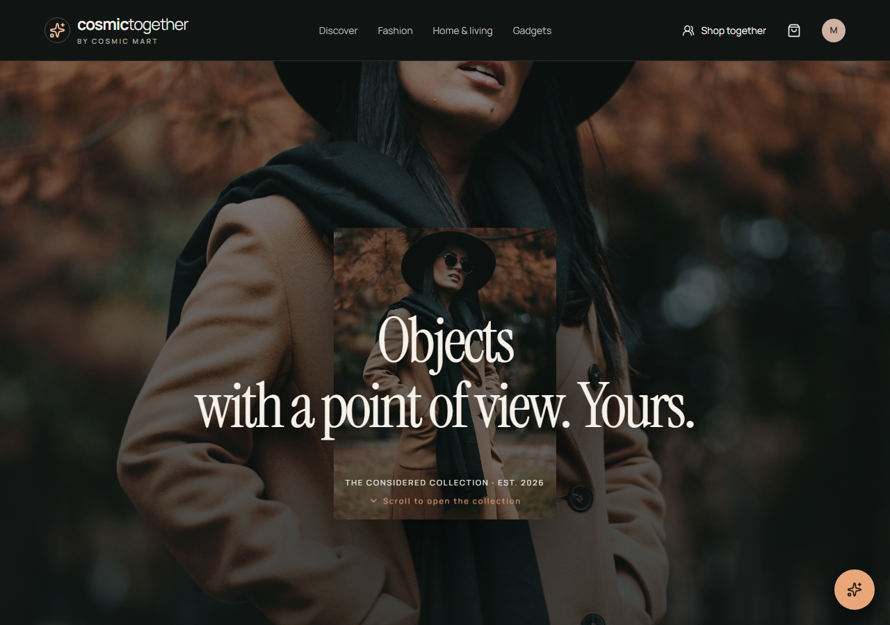
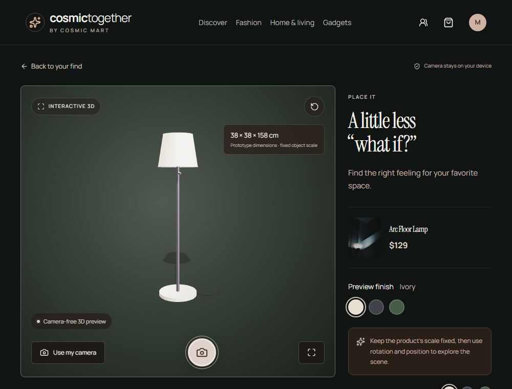
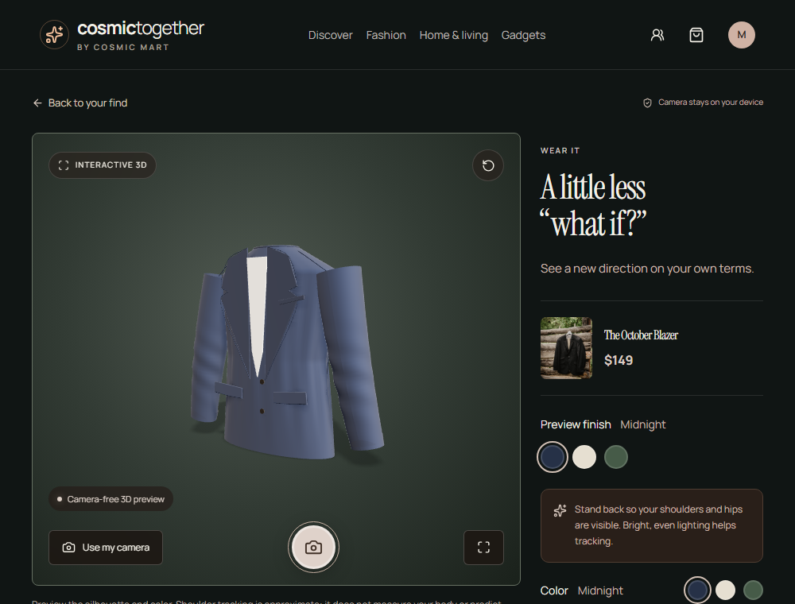
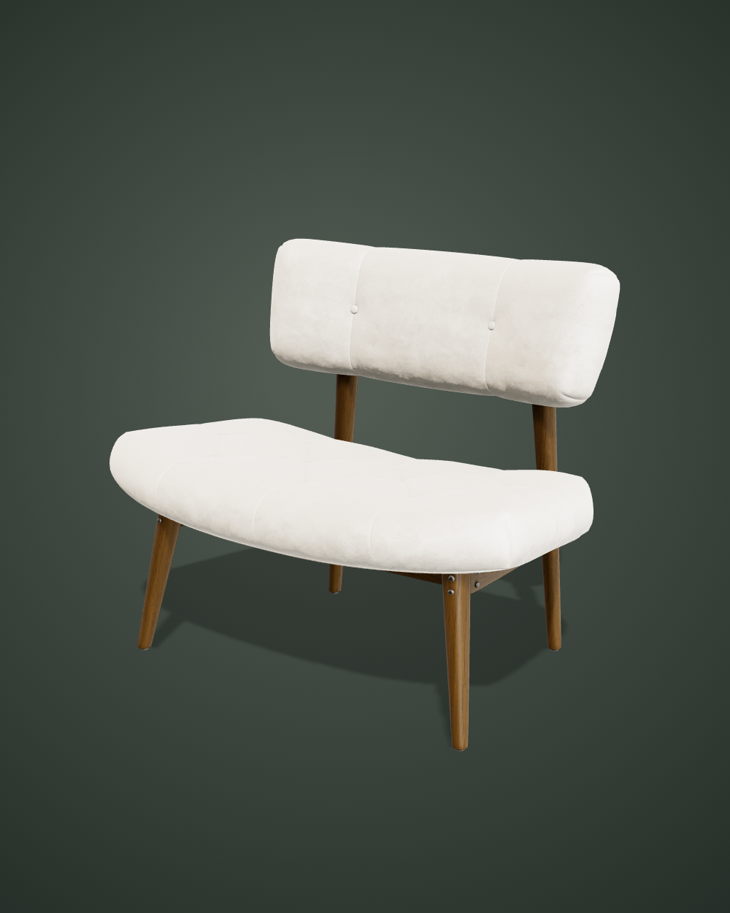
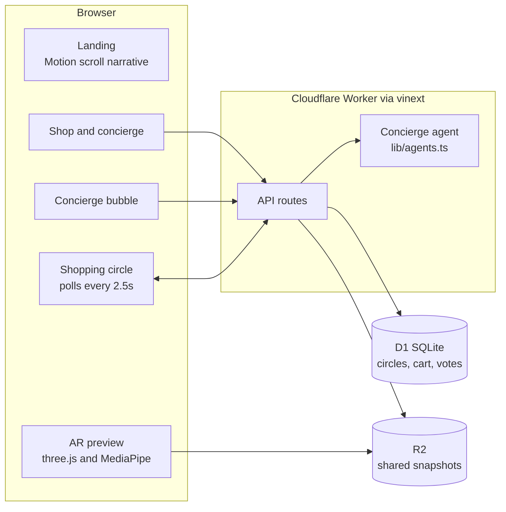

<p align="center">
  
</p>

# Cosmic Together

A shopping experience where a concierge helps you find a short list, your friends weigh in, and you can see the product in your own space before you decide. Built for the Astra Hackathon by the Windy City Wizards.

The app covers three categories: fashion, home and living, and gadgets. You describe what you want in plain language, the concierge returns a ranked short list with reasons, and you can open any product in an interactive 3D and camera preview. If you want a second opinion, you open a shopping circle, share a link, and everyone votes on the same short list in real time.

<p align="center">
  
</p>

## What it does

- **Concierge short lists.** Type an intent like "an outfit for a fall wedding under $200". The concierge parses the budget, occasion, and category, ranks the catalog, and returns up to three picks with the reasons and trade-offs behind each one.
- **A floating concierge bubble.** A copper launcher sits on every page. Open it, ask a question, and get product cards that link straight to the product and its AR preview. It stays out of the way on the AR screens.
- **See it in your world.** Every product opens in an interactive 3D preview lit by a studio HDRI. In camera mode you can drag to move, pinch to resize, and twist to rotate the product in your room. Fashion items track your shoulders through the camera so you can preview a silhouette.
- **Shopping circles.** Start a circle, copy the invite link, and bring friends in. Members vote on the short list, chat, and share private snapshots. Everyone sees the same state through a short polling loop.
- **Privacy by default.** The camera feed stays on the device. Snapshots are shared only when you choose to share them.

<p align="center">
  
  
</p>

<p align="center">
  
</p>

## How it works

The frontend is React 19 running on `vinext`, a Next-style framework that builds to a Cloudflare Worker. API routes run at the edge and read and write to D1 (SQLite) for circles, carts, and votes, and to R2 for shared snapshots. The concierge is a deterministic agent in `lib/agents.ts` that scores the catalog against your constraints, so the results are transparent and repeatable. The AR previews use raw three.js with MediaPipe pose tracking.



## Tech stack

- React 19, `vinext`, React Server Components
- Cloudflare Workers, D1 (SQLite), R2, Miniflare for local dev
- Drizzle ORM for the schema
- three.js 0.180 with the GLTFLoader and an HDRI environment for AR
- MediaPipe Tasks Vision for pose tracking
- Motion (the Framer Motion successor) for the landing scroll animations
- Tailwind plus a hand-written editorial stylesheet
- oxlint and TypeScript for the quality gates

## Running it locally

The app lives in `cosmic-together`. You need Node 22.13 or newer and pnpm.

```bash
cd cosmic-together
pnpm install
pnpm dev
```

Open http://localhost:3000. The Cloudflare vite plugin creates a local D1 database and R2 bucket for you, and the schema is applied on first request, so circles and carts work right away.

Useful scripts:

```bash
pnpm typecheck   # tsc --noEmit
pnpm lint        # oxlint
pnpm test        # agent logic tests
pnpm build       # production build for Cloudflare Workers
```

## Sharing a circle across devices

The invite link is built from the address you open the app on. To bring in a phone on the same Wi-Fi, open the app on your computer at your LAN address (for example `http://<your-ip>:3000`) so the copied link points there, and allow the dev port through your firewall. Camera AR needs a secure origin (HTTPS or localhost), so a hosted HTTPS deployment is the way to demo the try-on flow on another device. The 3D preview, circles, votes, chat, and snapshots all work over a plain LAN address.

## Project layout

```
cosmic-together/
  app/            routes, API handlers, global stylesheet
  components/     landing, shop, product, circle panel, agent bubble
  ar/             three.js scene, product models, garment, pose tracking
  lib/            concierge agent, catalog, contracts, server helpers
  db/             Drizzle schema and the D1 bootstrap
  drizzle/        SQL migrations
  public/         images, GLB models, the studio HDRI
docs/             README banner and screenshots
```

## Notes

This is a hackathon prototype. The catalog and inventory are sample data, no payment is taken, and the match scores come from transparent catalog rules and the preferences you set. Product photography and the 3D previews are illustrative.

## Team

Windy City Wizards, Astra Hackathon.
