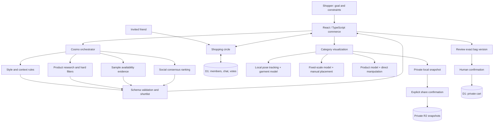

# Solution blueprint

The product addresses a case-study hypothesis: trusted social advice and visual product understanding can improve confidence in Fashion and Home & Lifestyle. The supplied April 2025 revenue chart is 77% Gadgets, 13% Fashion, and 10% Home & Lifestyle. These are case facts, not current market data or measured app impact.

The orchestrator is deterministic in this deployment. Its utility stages are individually identifiable and its evidence remains inspectable. A live LLM is an unconnected extension, not a hidden dependency or a claimed deployed capability.

Human control is enforced at camera access, image sharing, adding an item, and confirming selection. Friend votes can change the order of valid candidates, but never override hard budget or stock constraints. Product and profile data are separate from shared party views.

Production evolution: provider-backed schema-constrained intent extraction, real catalog and inventory adapters, verified identity, low-latency push transport, regional privacy/retention policy, authored GLB assets, validated body/room spatial tracking, assistive-device testing, and production instrumentation. Evaluate conversion and decision time experimentally; this prototype has no measured commercial uplift.
